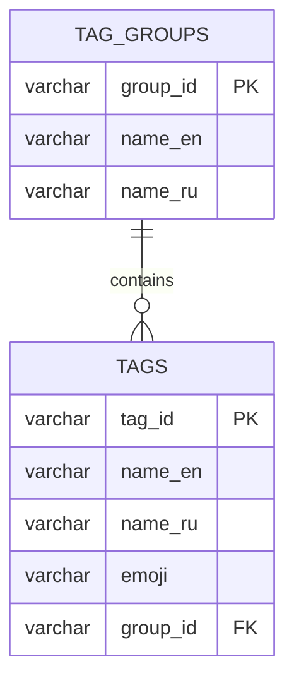

# ChefBook Backend Tag Service

The tag service owns tag taxonomy and localized lookup used by recipe search, filtering, and recipe metadata.

## Responsibilities

- Store tag groups.
- Store localized tags and emoji metadata.
- Provide tag lists, tag maps, single tag lookup, and tag group lookup.
- Keep fallback localization behavior close to tag persistence.

## Main RPC Families

- `GetTags`
- `GetTagsMap`
- `GetTag`
- `GetTagGroups`

## Dependencies

- Owns its PostgreSQL schema and migrations.
- Does not call other ChefBook services for core tag lookup.

## Database Ownership

Owns:

- `groups` - localized tag group names.
- `tags` - localized tag names, emoji, and group membership.

Important constraints:

- Tags belong to local tag groups.
- Localization fallback behavior is owned by this service.
